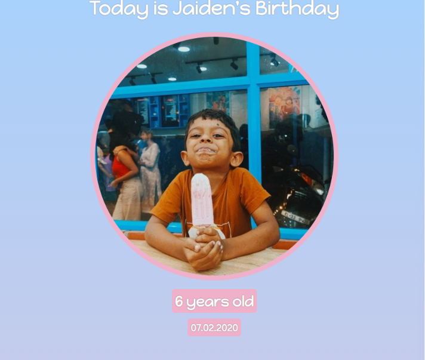

# 🎉 Birthday Gift Site

A fun and interactive birthday webpage built using **HTML** and **CSS**. The page celebrates a birthday with a personalized greeting, profile image, age, date of birth, and interactive gift boxes that reveal animated GIFs when hovered over.

## Live Demo

*Add your Netlify/GitHub Pages link here.*

## 📸 Preview

**

## Features

* Personalized birthday greeting
* Circular profile image
* Age and date badges
* Interactive gift boxes with hover effects
* Animated GIFs revealed on hover
* Gradient background
* Responsive centered layout using Flexbox

## Technologies Used

* HTML5
* CSS3
* Google Fonts

## Concepts I Learned

### HTML

* Structuring a webpage using semantic elements
* Working with images using the `` tag
* Creating links with the `<a>` tag
* Using `id` and `class` attributes effectively
* Organizing content with `
` containers

### CSS

* Styling elements using classes and IDs
* Applying custom fonts with Google Fonts
* Creating a linear gradient background
* Using Flexbox (`display: flex`) for layout
* Understanding the difference between the **main axis** and **cross axis**
* Centering elements using `align-items`
* Using `margin: auto` to horizontally center block elements
* Applying padding and margins to control spacing
* Styling circular images using `border-radius: 50%`
* Using `object-fit: cover` to maintain image proportions
* Creating text shadows with `text-shadow`
* Styling borders and rounded corners
* Working with background images
* Using `background-size: cover`
* Positioning background images with `background-position`
* Creating hover effects using the `:hover` pseudo-class
* Replacing background images with animated GIFs on hover
* Organizing and reusing styles through CSS classes

##  What I Practiced

* Building a complete webpage from scratch
* Creating reusable CSS classes
* Applying consistent spacing and alignment
* Designing interactive UI using only HTML and CSS
* Debugging layout and styling issues
* Improving visual design with gradients, shadows, borders, and hover animations

## Author

**Jerin John Chacko**

GitHub: https://github.com/yourusername
